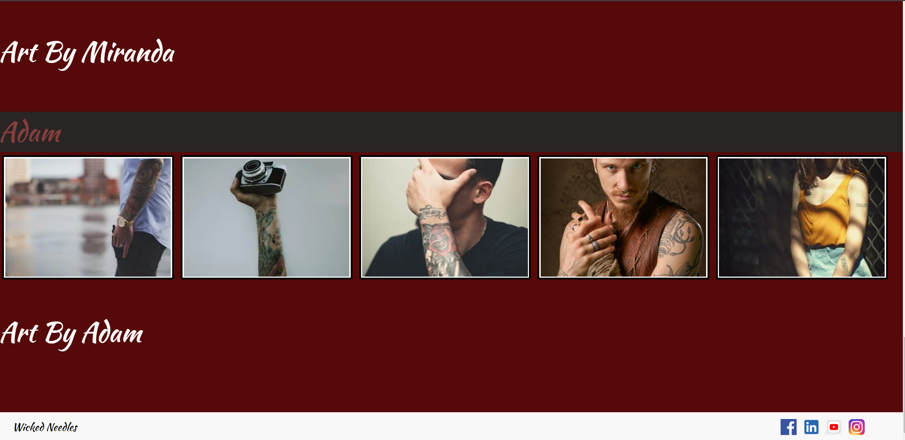
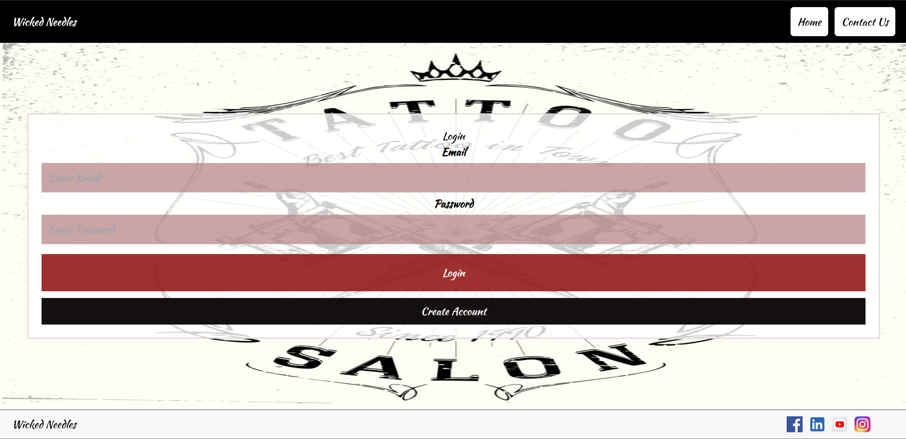
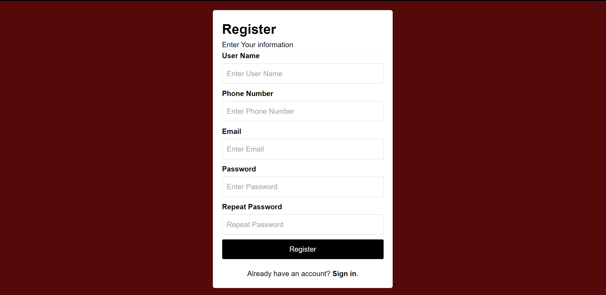
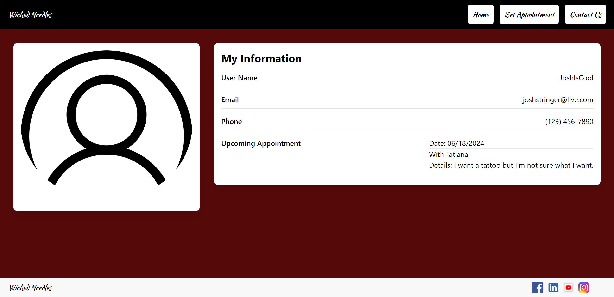
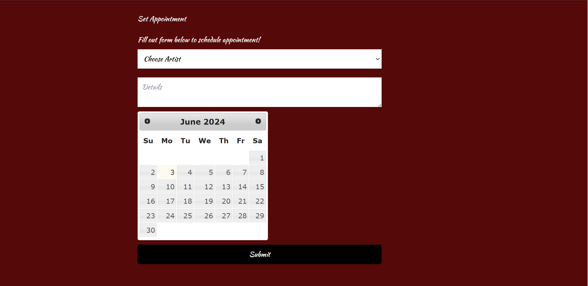
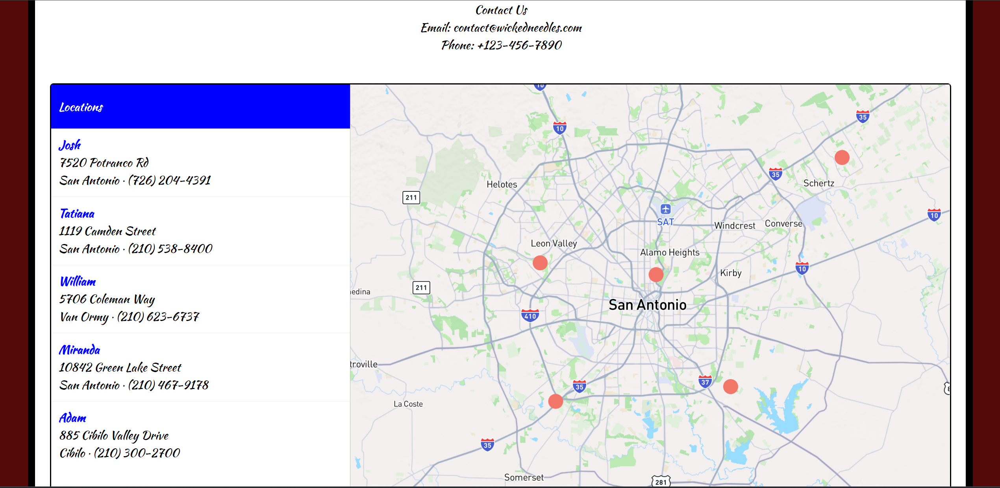

# Project-13

Description:
The repo features a website that allows potential clients to find and schedule appointments with tattoo artists in their area.

Installation:
N/A

Usage:
You can use this repo to create a profile that you can then use to see local tattoo artists and schedule appointments to speak with them via phone, email or in person consultations.

Link to site:
https://project1-13.github.io/Project-13/index.html

Credits:
All work done by Miranda De La Paz, Tatiana Carvajal, Adam Orf, William Morrison, and Josh Stringer

License:
Refer to the LICENSE in the repo.

